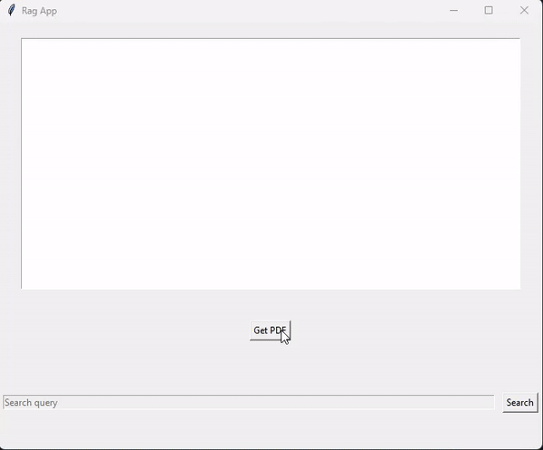

# AuroraFlow 
Aurora flow is basically an easy library for making custom LLMs using RAG. This repository consists of the
rag libraries and the custom LLMs using Hugging face. Currently the rag part of the project is finished.

## Aurora Rag
 A tool for RAG pipeline and easy processing of files. 
 The idea behind this is that one can feed in files in form of pdf such as scientific papers, books etc.
and the system gives you the most relevant answers it found in all these papers along with the page number and file it found it in. 

## Installation

1. Make a virtual environment:
````commandline
python -m venv .venv
````
2. Install requirements:
````commandline
pip install -r requirements.txt
````
3. Now run
````commandline
python -m apps.rag_app
````
The demo below shows how aurora flow helps one to extract relevant information for there search from the papers




## Multi Aurora Rag
THis app helps to group multiple sources books, research papers together and then search for the material. 

The running and installation is similar instead of step 3 you would do
````commandline
python -m apps.multi_rag_app
````
If you would want to pair program and contribute let me know would be happy to collab

